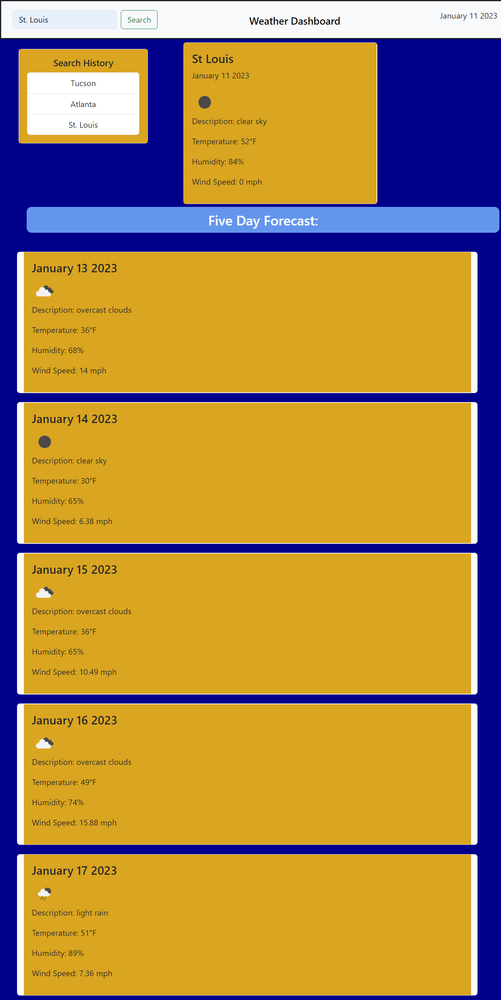

# weather-dashboard
An informational application that will return weather informaton based on a simple search.

## Description

A simple weather application that will return the current weather and a 5 Day Forecast.

## Usage

- Enter a city name in the search bar. If it's a city name that can exist in multiple locations will need to specify (Example: Springfield; Springfield, IL, USA or Springfield, MO, USA)
- The current weather will display for the city as well as a future forecast of the next 5 days.
- Every search is added to the search history and can be clicked to retrieve that city's weather data

[Click Here to Open](https://jminor90.github.io/weather-dashboard/)

## Credits

Coded by Joshua Minor (jminor90)

Resources
- [MDN](https://developer.mozilla.org/en-US/docs/Web/JavaScript)
- [jQuery](https://jquery.com/)
- [BootStrap](https://getbootstrap.com/)
- [OpenWeatherMap API](https://openweathermap.org/)
- [DayJS](https://day.js.org/)

## License

MIT License

view LICENSE.MD for more details
